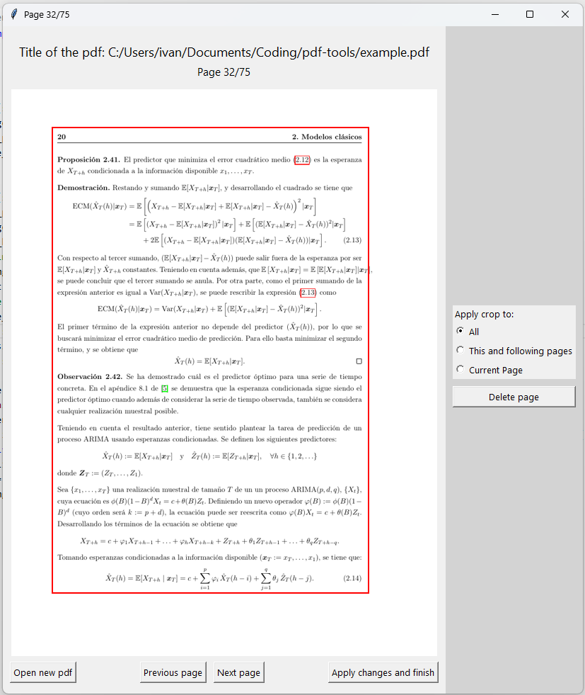

# PDF Tools

A desktop application for cropping and deleting pages from PDF files with a graphical user interface (GUI).



## Features
- Crop PDF pages visually using a drag-and-drop rectangle
- Delete individual pages
- Apply crop settings to all, current, or following pages
- Preview PDF pages as images
- Save edited PDF with changes

## Technologies Used
- Python 3
- Tkinter (GUI)
- PyPDF2 (PDF manipulation)
- pdf2image (PDF page preview)
- Pillow (image handling)

## Usage
Run the main application:
```powershell
python main.py
```

- Select a PDF file when prompted
- Crop pages by dragging on the preview
- Delete/restore pages using the button
- Apply changes and save the edited PDF

## Project Structure
- `main.py`: Entry point for the application
- `core/`: PDF processing and data models
  - `pdf_processor.py`: Handles cropping and deleting pages
  - `models.py`: Crop and crop settings data models
- `gui/`: GUI components
  - `main_window.py`: Main window and user interaction
  - `pdf_viewer.py`: PDF preview as images
